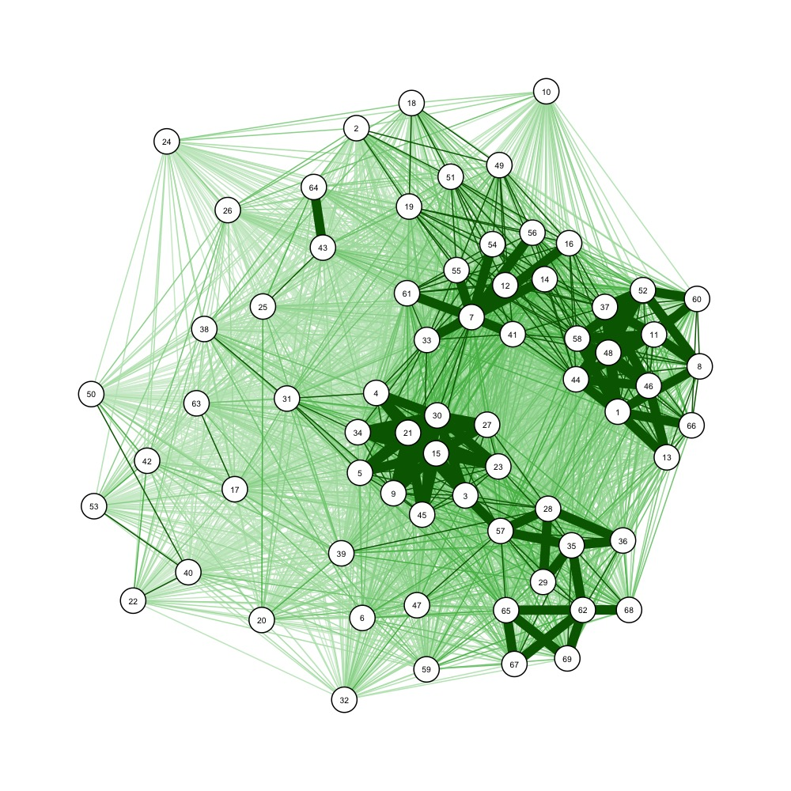

```{r setup, include=FALSE}
knitr::opts_chunk$set(echo = TRUE)
library(tidyverse)
library(combinat)
library(qgraph)
library(igraph)
library(factoextra)
# library(philentropy) # to compute dice metric
library(usedist) # to compute dice metric
library(hopkins)
library(seriation)
```

# Intro

Perhaps the dominant ideological impulse of the internet era is a broad and variously-described campaign for "decentralization." Calls for decentralization spurred the development of the early internet; more recently, they form the driving rhetorical impetus to the blockchain and Web3 movements. Though various definitions [@Hassan2021] [@Dalton1980] [@DLTS] and taxonomies [@Sai2021] [@Buterin2017] [@Siddarth2022] of decentralization have been offered, the notion's ambiguity constitutes a theoretical crux in the academic study of modern, especially digitally-enabled, organizations.

Decentralization is alleged to be beneficial for a variety of reasons. The blockchain community has historically focused on things like security, integrity, and resilience--resistance to attacks and collusion, avoidance of single points of failure, prevention of authoritarianism, etcetera [@Buterin2017]. For this reason, most past studies of decentralization in blockchains have defined decentralization in a technical sense (e.g., network measures on the underlying nodes [@Shahsavari2022]), or with an eye to security (e.g., how many entities it would take to execute a 51% attack [@Srinivasan2017]). These measures are not the focus of this analysis, but a recent DARPA-commissioned report summarizes the general evidence that the Web3 ecosystem has not, thus far, been very successful in achieving these goals [@TOB2022].

At the [Metagovernance Project](https://metagov.org/), we seek to shed light on modern problems of social coordination using the framework of *governance*. From the governance perspective, it can be difficult to define decentralization, except by the absence of a tyrant. 


DAOs are attempting to design and implement new systems of governance. They are doing so for various reasons (cite mission statements of different companies & stuff), but the most common theme is a broad and variously-described campaign for "decentralization." Politically, this comes down to expanding enfranchisement: increasing the number of people who can exercise power over the governance process.

The first attempts at DAO governance have proven naive, resulting in heaps of arcane proposals, extreme plutocracy, and so on--ultimately resulting in incredibly low participation rates across blockchains (cite). In order to avoid falling into the same traps as nation-state governments, DAO creators will need to think very carefully about how they design their governance systems.

The hard endpoint of political power in a democracy is voting. This makes voting systems the intuitive place to start for structurally improving the design of the governance process. People have come up with a wide range of proposals for alternative voting systems, including Quadratic Voting, Conviction Voting, Optimistic Voting, etc. etc..

However, these voting systems are very young and highly experimental. Their alleged superiority is argued via fuzzy verbal arguments. As these voting systems are taken into practice, we are bound to be surprised by the way that actual actors in the actual world end up using them--just as the founding fathers were been surprised by the formation of political parties. 

There are a few tools which we can bring to bear to understand the outcomes that different voting arrangements affect in practice. Mention game theory & simulation. The most powerful tool, however, is empirical investigation. As we look around at the governance arrangements which have been made, we can ask: to what extent do people's preferences in different domains tend to align? Can we identify forming coalitions or parties of people who want the same things? Basically, are different governance arrangements pushing people into political parties, in order to get things done? On the other hand, is there a preference-aligned voting coalition which dominates the system? 

This article does not attempt to propose a normative view for what level of coalitionality is desireable. Rather, we propose a method for evaluating the extent to which an existing voting environment displays preference-aligned coalitions, and the distribution of power between what coalitions do exist. 


At the [Metagovernance Project](https://metagov.org/), we seek to shed light on modern problems of social coordination using the framework of *governance*. From the governance perspective, "decentralization" has much to do with **the distribution of power between individuals.** While power over the underlying infrastructure--the type of power wielded by validators, for example--is an example of this, we ultimately want "substrate-independent" measures of power distribution. The easy, well-defined starting point for this analysis is *voting power*. Voting is far from the whole story of governance, but it is an important source of hard power within a democratic system. 

This article is an effort to explore the problem of decentralization--its motivations, representations, and potential effects--from the perspective of governance. Ultimately, it is part of a push to establish an expressive formal language for researchers grappling with the extremely difficult, increasingly complex, and all-too-salient problems presented by 21st-century collective action.


# Data

# The Voting Network

# Decentralization
## Graph-Based Measures, Ideological Decentralization
## The Power of Coalitions

# Conclusion


# Background and Motivation

Perhaps the dominant ideological impulse of the internet era is a broad and variously-described campaign for "decentralization." Calls for decentralization spurred the development of the early internet; more recently, they form the driving rhetorical impetus to the blockchain and Web3 movements. Though various definitions [@Hassan2021] [@Dalton1980] [@DLTS] and taxonomies [@Sai2021] [@Buterin2017] [@Siddarth2022] of decentralization have been offered, the notion's ambiguity constitutes a major theoretical crux in the academic study of modern, especially digitally-enabled, organizations.

At the [Metagovernance Project](https://metagov.org/), we seek to shed light on modern problems of social coordination using the framework of *governance*. This article is a preliminary effort to explore the problem of decentralization--its motivations, representations, and potential effects--from the perspective of governance. Ultimately, it is part of a push to establish an expressive formal language for researchers grappling with the extremely difficult, increasingly complex, and all-too-salient problems presented by 21st-century collective action.

# The Voting Perspective

Decentralization is alleged to be beneficial for a variety of reasons. The blockchain community has historically focused on things like security, integrity, and resilience--resistance to attacks and collusion, avoidance of single points of failure, prevention of authoritarianism, etcetera [@Buterin2017]. For this reason, most past studies of decentralization in blockchains have defined decentralization in a technical sense (e.g., network measures on the underlying nodes [@Shahsavari2022]), or with an eye to security (e.g., how many entities it would take to execute a 51% attack [@Srinivasan2017]). These measures are not the focus of this analysis, but a recent DARPA-commissioned report summarizes the general evidence that the Web3 ecosystem has not, thus far, been very successful in achieving these goals [@TOB2022].

We're interested in sociopolitical arrangements within a general class organizations, so for us, "decentralization" has much to do with distribution of power between individuals. While power over the underlying infrastructure--the type of power wielded by validators, for example--is an example of this, we ultimately want "substrate-independent" measures of power distribution. The easy, well-defined starting point for this analysis is *voting power*. Voting is far from the whole story of governance, but it is an important source of hard power within a democratic system. Additionally, analyzing voting data could help illuminate less visible governance factors like social influence, agenda-setting power [@Rossiter2021], and ideological or cultural topology.

# Data

Decentralized Autonomous Organizations are a good subject of governance study due to their diversity and openness to experimentation. They also care (a lot) about decentralization and effective governance. For this analysis I used voting data from [Snapshot](https://snapshot.org/#/), a popular off-chain voting platform. In particular, I gathered a dataset of votes from the [Proof-of-Humanity snapshot](https://snapshot.org/#/poh.eth) (see the code used to gather this dataset [here](https://github.com/tobyweed/voting_games/blob/master/voting_data.Rmd)).

```{r}
votes <- read.csv("votes.csv", colClasses = c("Voter.ID" = "character")) # Voter.ID will be read as a hex number if type is unspecified
```


**Note:** I chose Proof of Humanity because they have relatively few active voters, and their votes tend to be relatively controversial, while many DAO votes are more or less unanimous. However, voting data could be gathered from any DAO on Snapshot within a couple of minutes using the same code.


I chose to focus on the seven most recent proposals with binary voting, for the reason that these have highly-overlapping voter pools. This will make our clustering analysis later on more meaningful. However, one can easily imagine analyzing more proposals.

```{r clean, include=FALSE}
# restrict our attention to proposals not made before 0x824953e27fca1b0dbc0242b82750afbd2efb6b60621a6383674653bc826ef9c8
start_time <- votes %>%
  filter(Proposal.ID == "0x824953e27fca1b0dbc0242b82750afbd2efb6b60621a6383674653bc826ef9c8") %>%
  arrange(Time.Created) %>%
  head(1)
 
start_time <- start_time$Time.Created
v1 <- votes %>%
  filter(Time.Created >= start_time)
# count number of votes cast per voter
v1 <- v1 %>%
  group_by(Voter.ID) %>%
  mutate(N.Votes = n())
length(unique(v1$Voter.ID)) # we have 658  individual voters after this time
length(unique(v1$Proposal.ID)) # and 7 proposals
# and 69 voters who cast at least 4 votes
v1 %>%
  filter(N.Votes >= 4) %>%
  select(Voter.ID) %>%
  unique() %>%
  nrow()
# lets focus on these repeat voters
v1 <- v1 %>%
  filter(N.Votes >= 4) 
```

This leaves us with a very manageable set of 69 voters and 7 proposals.


# Analysis
## Generating a Voting Graph

To start off, we'll organize our data into a table with individual voters as the rows, proposals as the columns, and cells corresponding to voters' choices.

```{r vot_tab, include=FALSE}
# make a table with rows=voters and cols=proposals, with cell values=how they voted.
proposals <- unique(v1$Proposal.ID)
voters <- unique(v1$Voter.ID)
vot_tab <- data.frame(matrix(nrow = length(voters), ncol= length(proposals)))
colnames(vot_tab) <- proposals
rownames(vot_tab) <- voters
# Note: this code is highly inefficient and could be made much faster.
for(i in 1:nrow(vot_tab)) {
  for(j in 1:ncol(vot_tab)) {
    row <- filter(v1, Voter.ID == voters[i], Proposal.ID == proposals[j])
    if(nrow(row) != 0) {
      vot_tab[i,j] <- row$Choice
    }
  }
}
# make the cols a little nicer
colnames(vot_tab) <- 1:length(proposals)
rownames(vot_tab) <- 1:length(voters)
```

```{r}
vot_tab
```

How should we analyze decentralization in this voting system? Traditional political science models of voting power include the [Shapley-Shubik](https://en.wikipedia.org/wiki/Shapley%E2%80%93Shubik_power_index#:~:text=The%20Shapley%E2%80%93Shubik%20power%20index,not%20obvious%20on%20the%20surface.) and [Banzhaf](https://en.wikipedia.org/wiki/Banzhaf_power_index) indices, which both measure (in different ways) the likelihood that a coalition swings the vote in any given way. One simple idea would be to take a look at the distribution of "voting power," variously defined, among different entities within a system.

Of course, this brings up the question of how we'd like to define "entities" in the DAO context. This question is actually more interesting than it might appear at first glance; the analogy with traditional democratic assemblies (e.g. within nation-states) tells us that groups of individuals often self-organize into coalitions which generally operate as a unit. One important and interesting governance question, then, is to what extent do individuals within an organization form discrete coalitions? Posed more holistically, what is the topology of *preferences* within the voting body?

```{r}
# how many missing values do we have?
na_counts <- rowSums(is.na(vot_tab))
table(na_counts)
mean(na_counts)
```

Six voters voted on every proposal, 22 missed at most one, and 37 missed at most two. The average voter in our set missed about two of the seven votes we're looking at. This is not too sparse a dataset (by design), so we'll go ahead and measure the similarity between each voter's voting record. We'd like the distance between two voters to be the sum of the distance between their votes on each proposal, i.e. $d(\vec{x}, \vec{y}) = \sum_i d(x_i,y_i)$. We also might want `NA` votes (abstensions) to be halfway between a "yes" and a "no." This corresponds to using the [Manhattan metric](https://en.wikipedia.org/wiki/Taxicab_geometry) and replacing `NA` values with `1.5`, since the voting options are `1` and `2`.

Dice coefficient:
$$
{\displaystyle d(X, Y) = 1 - D(X,Y)

{\frac {2|X\cap Y|}{|X|+|Y|}}}
$$

$$
{\displaystyle d(X, Y) = 1 - D(X,Y)}
$$

```{r}
vot_tab <- vot_tab_copy

# OPTION 1 (best?)
# NAs just aren't considered: (NA, NA, 1), (NA, NA, 1) is 0 distance, (NA, NA, 1), (NA, NA, 2) is 1 distance
dice_metric <- function(x, y) {
  n_votes <- c(length(which(!is.na(x))), length(which(!is.na(y)))) 
  1 - length(which(x == y))/sum(n_votes) # 1 - dice coefficient (to make it a metric)
                                         # Dice coeff: 2*| X intersect Y | / |X| + |Y|
}

# OPTION 2 (worst)
# # NAs are counted to the totals but not vote similarities: (NA, NA, 1), (NA, NA, 1) is 1/3 distance, (NA, NA, 1), (NA, NA, 2) is 1 distance
# 
# dice_metric <- function (x, y) 1 - (2*length(which(x == y))/(length(x) + length(y))) # 1 - dice coefficient (to make it a metric)
#                                                                                      # Dice coeff: 2*| X intersect Y | / |X| + |Y|
# 

# OPTION 3 (not bad)
# # NAs are counted as as a third vote: (NA, NA, 1), (NA, NA, 1) is 0 distance, (NA, NA, 1), (NA, NA, 2) is 2/3 distance
# # we're treating NAs, 1s & 2s all as categorical options. Possible downside is that abstensions are weighted as regular votes.
# vot_tab[is.na(vot_tab)] <- "a"
# vot_tab[vot_tab == 1] <- "b"
# vot_tab[vot_tab == 2] <- "c"
# dice_metric <- function (x, y) 1 - (2*length(which(x == y))/(length(x) + length(y))) # 1 - dice coefficient (to make it a metric)
#                                                                                      # Dice coeff: 2*| X intersect Y | / |X| + |Y|


vot_mat <- data.matrix(vot_tab, rownames.force = NA)

dist <- dist_make(vot_mat, dice_metric)

dist_mat <- as.matrix(dist)
```


Now, we can represent the voting similarities as a weighted graph.

```{r graph, include=FALSE}
# Make a voting graph
jpeg('votegraph.jpg', width=1000, height=1000, unit='px')
qgraph(1 - dist_mat, layout='spring', vsize=3)
dev.off()
```




It looks like there are at least a couple of pretty densely-connected clusters of similar voters. Down the line, this kind of representation could play a role in a more general analysis of ideological affiliation, which could tell us things about cohesion, polarization, and so on.

**Note 1:** one can easily imagine defining a multilayer network by bringing in data from other DAOs, since addresses often hold voting tokens in multiple DAOs. This would allow a more general analysis of preference topology and voting influence within the broader DAO ecosystem, which could be pretty interesting.


**Note 2:** it might also be interesting to quantify the "preference centralization" or "polarization" within our voting graph using graph-based measures of clustering and decentralization, such as closeness centrality, degree centrality, Freeman centralization, local clustering coefficient, global clustering coefficient, etc..


## Identifying Coalitions
Are there groups of voters who tend to vote the same way, or "coalitions," present in our data? If so, how many?

To answer this question, we'll use standard clustering analysis, although one might also try more network-specific [community detection algorithms](https://arxiv.org/pdf/0908.1062.pdf). INSERT NOTE ABOUT NETWORK REPRESENTATION VS METRIC SPACE

We can see visually from our graph that the right answer seems to be that the data *does* present clusters, and that there are basically two, along with a bunch of relatively independent voters. However, since this post is more about methodology than the specific analysis of this data, we'll show how you might interrogate this question quantitatively if you had a more complex or ambiguous dataset. 

### Hopkins
The usual tool is the [Hopkins statistic](https://en.wikipedia.org/wiki/Hopkins_statistic), defined as:

${\displaystyle H={\frac {\sum _{i=1}^{m}{u_{i}^{d}}}{\sum _{i=1}^{m}{u_{i}^{d}}+\sum _{i=1}^{m}{w_{i}^{d}}}}\,},$

where 


```{r}
hops <- c()
for(i in 1:1000) {
  vot_tab[is.na(vot_tab)] <- 0
  hops <- append(hops,hopkins(vot_tab, ceiling(nrow(vot_tab)/4)))
}
mean(hops)
```


### VAT

```{r}
dissplot(dist_mat)
```


In order to get a rough power distribution, we can define "coalitions" or "voting blocs" by hierarchically clustering on this graph.


```{r}
hc <- hclust(dist, method = "average")
plot(hc, main = "Dendrogram of Voting Preferences", xlab = "", sub = "",
     cex = 0.5)
```


Let's define 5 coalitions, just cause.


**Note:** I'm choosing complete linkage clustering and a number of clusters/threshold for voting agreement within coalitions pretty arbitrarily. One can imagine only defining coalitions which agree completely, or which correspond to prior knowledge of actual actors within a system. Nonetheless, I think it's an interesting exercise.

```{r}
fviz_nbclust(vot_tab, hcut, method = "silhouette", diss = dist, k.max = 24)
fviz_nbclust(vot_tab, hcut, method = "wss", diss = dist, k.max = 24)
fviz_nbclust(vot_tab, hcut, method = "gap_stat", diss = dist, k.max = 24)
```

```{r}
# Cluster the voters into voting "blocs"
# hc_clusters <- cutree(hc, h = 0.88)
hc_clusters <- cutree(hc, 5)
```


```{r blocs, include=FALSE}
v2 <- v1 %>%
  add_column(Bloc = NA)
for(i in 1:length(voters)) {
  id <- voters[i]
  rows <- which(v2$Voter.ID == id)
  v2$Bloc[rows] <- hc_clusters[i]
}
```


```{r}
hc_clusters
```


**Note:** It'd be fun to redraw the voting graph, coloring nodes by the clusters they belong to and maybe adjusting their size by their voting weight.


So, given these voting blocs, what's the distribution of voting tokens?


```{r bloc1, include=FALSE}
# count each Bloc's voting weight, using each voter's max weight
v2 <- v2 %>%
  group_by(Voter.ID) %>%
  mutate(Max.Weight = max(Weight))

# get a list of weights per voter
weights <- c()
for(i in 1:length(voters)) {
  sample <- v2 %>%
    filter(Voter.ID == voters[i]) %>%
    head(1)
  weights <- append(weights,sample$Max.Weight)
}
```

```{r}
# make a bar chart of voters' weights, colored by Bloc

voter_weights_blocs <- data.frame(Weight = weights, Bloc = hc_clusters)
voter_weights_blocs$ID <- rownames(voter_weights_blocs)
voter_weights_blocs <- within(voter_weights_blocs, Factor <- ave(as.character(Weight),FUN=make.unique)) # make a sortable factor based on Weight

# figure out how to order things by weight
order <- reorder(voter_weights_blocs$Factor, sort(as.numeric(voter_weights_blocs$Factor), decreasing = TRUE))
levels(order) <- sort(as.numeric(levels(order)))
voter_weights_blocs$order <- factor(voter_weights_blocs$Weight, levels = unique(order))

voter_weights_blocs %>%
  ggplot(aes(x = order, y = Weight, fill = factor(Bloc))) +
  geom_col(color = "black") +
  # theme(axis.text.x = element_blank(), axis.ticks.x = element_blank()) +
  ggtitle("Individual Voters by Weight") +
  xlab("Voter Weight") +
  ylab("Total Weight") + 
  labs(fill = "Coalition") +
  scale_fill_manual(values=c("#ff6c67",
                             "#a3a600",
                             "#00c377",
                             "#00b1fc",
                             "#f95dfa"))
```
```{r}
voter_weights_blocs %>%
  ggplot(aes(x = order, y = Weight/sum(Weight), fill = factor(Bloc))) +
  geom_col(color = "black") +
  # theme(axis.text.x = element_blank(), axis.ticks.x = element_blank()) +
  ggtitle("Individual Voters by Weight") +
  xlab("Voter Weight") +
  ylab("Portion of Total Weight") + 
  labs(fill = "Coalition") +
  scale_fill_manual(values=c("#ff6c67",
                             "#a3a600",
                             "#00c377",
                             "#00b1fc",
                             "#f95dfa"))


```


```{r}
order <- reorder(voter_weights_blocs$Factor, sort(as.numeric(voter_weights_blocs$Factor), decreasing = TRUE))

factor(voter_weights_blocs$Factor, levels = order(unique(as.numeric(voter_weights_blocs$Factor))))
sort(as.numeric(voter_weights_blocs$Factor), decreasing = TRUE)

levels(order) <- sort(as.numeric(levels(order)))

sort(unique(as.numeric(voter_weights_blocs$Factor)))
```


```{r}
blocs <- list(which(hc_clusters == 1), 
              which(hc_clusters == 2),
              which(hc_clusters == 3),
              which(hc_clusters == 4),
              which(hc_clusters == 5))
# g <- qgraph(1 - dist_mat, groups = blocs, layout='spring', vsize=weights)

# https://cran.r-project.org/web/packages/qgraph/qgraph.pdf
g <- qgraph(1 - dist_mat, 
            layout='spring', 
            repulsion=0.8,
            # threshold = 0.1,
            # nodes:
            groups = blocs,
            vsize = 1+log(weights),
            labels = FALSE,
            borders = FALSE,
            # edges:
            edge.color = "#565656",
            colFactor = 3,
            # styling:
            # legend = TRUE,
            palette = "ggplot2",
            aspect = TRUE
            # title = "PoH Voter Similarity Network"
            )
```
```{r}
# Grey version
g <- qgraph(1 - dist_mat, 
            layout='spring', 
            repulsion=0.8,
            # nodes:
            vsize = 1,
            color = "grey",
            labels = FALSE,
            # edges:
            edge.color = "#565656",
            colFactor = 3,
            # styling:
            palette = "ggplot2",
            aspect = TRUE
            )
```


```{r}
senate_votes <- read.csv("senate114_2.csv")
# senate_votes <- read.csv("senate101_1.csv")
sen_vot_mat <- data.matrix(senate_votes, rownames.force = NA)
sen_dist <- dist_make(sen_vot_mat, dice_metric)
sen_dist_mat <- as.matrix(sen_dist)
```

```{r}
# Senate stuff
sen_hc <- hclust(sen_dist, method = "complete")
sen_hc_clusters <- cutree(sen_hc, 3)

sen_blocs <- list(which(sen_hc_clusters == 1), 
              which(sen_hc_clusters == 2),
              which(sen_hc_clusters == 3))

g <- qgraph(1 - sen_dist_mat, 
            layout='spring', 
            repulsion=0.8,
            # nodes:
            vsize = 1,
            colors = c("red", "#041aba", "gray"),
            # color = "gray",
            groups = sen_blocs,
            labels = FALSE,
            # edges:
            edge.color = "#565656",
            colFactor = 3,
            # styling:
            palette = "ggplot2",
            aspect = TRUE
            )
```


```{r bloc1, include=FALSE}
bloc_dist <- v2 %>%
  group_by(Bloc, Voter.ID, Max.Weight) %>%
  nest() %>%
  group_by(Bloc) %>%
  summarize(Bloc.Weight = sum(Max.Weight))
```

```{r}
# Colors: 
# A: ff6c67
# B: a3a600
# C: 00c377
# D: 00b1fc
# E: f95dfa

bloc_dist %>% ggplot(aes(x = Bloc, y = Bloc.Weight, fill = factor(Bloc))) +
  geom_col() +
  ggtitle("Voting Power by Coalition") +
  xlab("Coalition") +
  ylab("Total Weight") + 
  labs(fill = "Coalition") +
  scale_fill_manual(values=c("#ff6c67",
                             "#a3a600",
                             "#00c377",
                             "#00b1fc",
                             "#f95dfa"))
```


We can measure the "voting token wealth inequality" by Gini coefficient:


```{r gini, include=FALSE}
# compute the gini coefficient of a given distribution
gini <- function(dist) {
  
  # area between Lorenz curve and line of equality
  num <- 0
  for(x in dist) {
    for(y in dist) {
      num <- num + abs(x - y)
    }
  }
  
  # area below line of equality
  denom <- 2*(length(dist))^2*mean(dist)
  
  num/denom
}
```

```{r}
gini(bloc_dist$Bloc.Weight)
```


or the voting power distribution by Shapley-Shubik index:


```{r ssi, include=FALSE}
# compute Shapley-Shubik indices for a given distribution 
# params:
#   - dist: a distribution of voting power per voter
#   - thresh: the percentage of votes required to win, e.g. 0.5
ssi <- function(dist, thresh) {
  thresh_num <- ceiling(sum(dist)*thresh) # the number of votes required to win
  index_perm <- permn(1:length(dist)) # all possible voting orders
  ssis <- numeric(length(dist)) # a vector to store the S-S index for each voter
  
  # find the swing for each voting order
  for(order in index_perm) {
    tot_votes <- 0
    i <- 1
    while(tot_votes < thresh_num && i <= length(order)) { # identify the swing or determine that there is none
      tot_votes <- tot_votes + dist[order[i]]
      i <- i + 1
    }
    
    if(tot_votes >= thresh_num) { # increment the S-S index for the correct voter if the measure passed
      ssis[order[i - 1]] <- ssis[order[i - 1]] + 1
    }
  }
  
  ssis
}
# calculate the S-S indices as a probability dist; proportions rather than sums
ssi_prop <- function(dist, thresh) {
  ssis <- ssi(dist,thresh)
  ssis/sum(ssis)
}
bloc_dist$SSI <- ssi_prop(bloc_dist$Bloc.Weight, 0.5)
```


```{r}
bloc_dist %>% ggplot(aes(x = Bloc, y = SSI, fill = factor(Bloc))) +
  geom_col() +
  ggtitle("Shapley Shubik Index by Coalition") +
  xlab("Coalition") +
  ylab("Shapley-Shubik Index") + 
  labs(fill = "Coalition") +
  scale_fill_manual(values=c("#ff6c67",
                             "#a3a600",
                             "#00c377",
                             "#00b1fc",
                             "#f95dfa"))
```

# Conclusion

This is obviously very much a work-in-progress, and much of the "analysis" is completely arbitrary. That said, I think it shows that there's some interesting insight to be drawn *just* from analyzing voting data in DAOs. The notes throughout draw attention to directions one could go, either by including more diverse data, considering different representations, engaging in more rigorous justification, or probing the analysis with different visualizations and metrics.

In terms of the future direction of the decentralization metrics project, I do think that we'll get a lot of value by looking at more holistic data than just voting records. That being said, I think that the voting perspective has the advantage of being really easy to analyze, and could shed light on more subtle dynamics (and might inspire interesting formal DAO representations, which I guess is what we're really after). At the very least I think another week or two here could produce a solid blog post.


# References